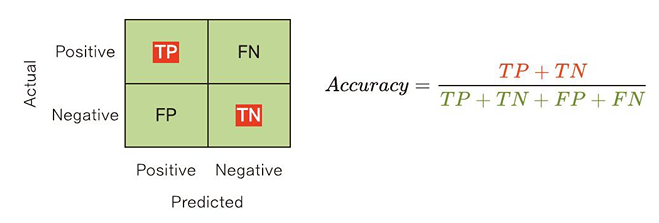
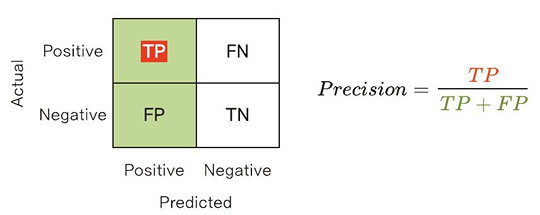
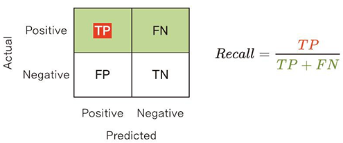
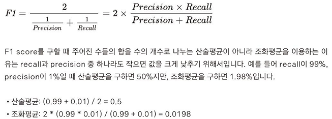

```{r setup, include=FALSE}
# 파이썬 경로를 직접 지정 (환경 변수 무시하고 이 경로로 실행)
knitr::opts_chunk$set(engine.path = list(
  python = "C:/Users/Andy/AppData/Local/Programs/Python/Python312/python.exe"))
```


```{python}
#| echo: false
# 데이터 프레임 하단 행, 열 개수 표기X
import pandas as pd
pd.options.display.show_dimensions = False

# 한글 우측 줄맞춤
import pandas as pd
pd.set_option("display.unicode.east_asian_width", True)

```


### {data-menu-title="Info"}


<!-- fa 아이콘 출력 설정 -->
<!-- []} -->

:::: {.columns}

::: {.column width="45%"}

<br>
<br>

{fig-align="center" width="75%"}

:::

<!-- width: 55% -->

::: {.column width="55%"}

<br>
<br>
<br>

`r fontawesome::fa("github", margin_left = '-0.5em')` [github.com/youngwoos/Doit_Python](https://github.com/youngwoos/Doit_Python)

`r fontawesome::fa("facebook-square", margin_left = '-0.5em')` [facebook.com/groups/datacommunity](https://facebook.com/groups/datacommunity)

`r fontawesome::fa('desktop', margin_left = '-0.5em', width = '0.9em')` [ 슬라이드 목록](https://github.com/youngwoos/Doit_Python/blob/main/docs/README.md)

`r fontawesome::fa("book", margin_left = '-0.5em')` [네이버책](https://search.shopping.naver.com/book/catalog/32474211621)

<br-back-20>

&nbsp;&nbsp; ▪ [yes24](http://www.yes24.com/Product/Goods/108947478)

&nbsp;&nbsp; ▪ [알라딘](https://www.aladin.co.kr/shop/wproduct.aspx?ISBN=K162837601)

&nbsp;&nbsp; ▪ [교보문고](http://www.kyobobook.co.kr/product/detailViewKor.laf?ejkGb=KOR&mallGb=KOR&barcode=9791163033493)

:::

::::


::: {background-color="#FF7232" transition="fade"}


# 15 머신 러닝을 이용한 예측 분석

## 15-2 소득 예측 모델 만들기

```{python}
import pandas as pd
df = pd.read_csv('adult.csv')
df.info() # 출력 후반부 생략
```

### 전처리하기

#### 1. 타겟 변수 전처리

```{python}
df['income'].value_counts(normalize = True)
```

```{python}
import numpy as np
df['income'] = np.where(df['income'] == '>50K', 'high', 'low')
df['income'].value_counts(normalize = True)
```

###
#### 2. 불필요한 변수 제거하기

```{python}
df = df.drop(columns = 'fnlwgt')
```

#### 3. 문자 타입 변수를 숫자 타입으로 바꾸기

**원핫 인코딩하기**

```{python}
df_tmp = df[['sex']]
df_tmp.info()
```

###
```{python}
df_tmp['sex'].value_counts()
```

```{python}
# df_tmp의 문자 타입 변수에 원핫 인코딩 적용
df_tmp = pd.get_dummies(df_tmp)
df_tmp.info()
```

###
```{python}
df_tmp[['sex_Female', 'sex_Male']].head()
```

```{python}
target = df['income']             # income 추출

df = df.drop(columns = 'income')  # income 제거
df = pd.get_dummies(df)           # 문자 타입 변수 원핫 인코딩

df['income'] = target             # df에 target 삽입
df.info()
```

###
```{python}
import numpy as np
df.info(max_cols = np.inf)
```

###
```{python}
import numpy as np
df.iloc[:,6:14].info()
```

###
#### 4. 데이터 분할하기

#### `adult` 데이터 분할하기

```{python}
from sklearn.model_selection import train_test_split
df_train, df_test = train_test_split(df,
                                     test_size = 0.3,          # 테스트 세트 비율
                                     stratify = df['income'],  # 타겟 변수 비율 유지
                                     random_state = 1234)      # 난수 고정
```

```{python}
# train
df_train.shape
```

```{python}
# test
df_test.shape
```
###
```{python}
# train
df_train['income'].value_counts(normalize = True)
```

```{python}
# test
df_test['income'].value_counts(normalize = True)
```

### 의사결정나무 모델 만들기

#### 모델 설정하기

```{python}
from sklearn import tree
clf = tree.DecisionTreeClassifier(random_state = 1234,  # 난수 고정
                                  max_depth = 3)        # 나무 깊이
```

#### 모델 만들기

```{python}
train_x = df_train.drop(columns = 'income')  # 예측 변수 추출
train_y = df_train['income']                 # 타겟 변수 추출

model = clf.fit(X = train_x, y = train_y)    # 모델 만들기
```

### 모델 구조 살펴보기

```{python}
import matplotlib.pyplot as plt
plt.rcParams.update({'figure.dpi'     : '100',     # 그래프 크기 설정
                     'figure.figsize' : [12, 8]})  # 해상도 설정                     
tree.plot_tree(model);                             # 그래프 출력
```

###
```{python}
tree.plot_tree(model,
               feature_names = train_x.columns,  # 예측 변수명
               class_names = ['high', 'low'],    # 타겟 변수 클래스, 알파벳순
               proportion = True,                # 비율 표기
               filled = True,                    # 색칠
               rounded = True,                   # 둥근 테두리
               impurity = False,                 # 불순도 표시
               label = 'root',                   # label 표시 위치
               fontsize = 10);                   # 글자 크기
```

### 모델을 이용해 예측하기

```{python}
test_x = df_test.drop(columns = 'income')  # 예측 변수 추출
test_y = df_test['income']                 # 타겟 변수 추출
```

```{python}
# 예측값 구하기
df_test['pred'] = model.predict(test_x)
df_test
```

### 성능 평가하기

#### confusion matrix 만들기

```{python}
from sklearn.metrics import confusion_matrix
conf_mat = confusion_matrix(y_true = df_test['income'],  # 실제값
                            y_pred = df_test['pred'],    # 예측값
                            labels = ['high', 'low'])    # 클래스 배치 순서
conf_mat
```

```{python}
plt.rcParams.update(plt.rcParamsDefault)        # 그래프 설정 되돌리기
```

###
```{python}
from sklearn.metrics import ConfusionMatrixDisplay
p = ConfusionMatrixDisplay(confusion_matrix = conf_mat,       # 컨퓨전 매트릭스
                           display_labels = ('high', 'low'))  # 타겟 변수 클래스명

p.plot(cmap = 'Blues')                                        # 컬러맵 적용해 출력
plt.show()
```

###
#### 성능 평가 지표 구하기

**accuracy**

```{python}
import sklearn.metrics as metrics
metrics.accuracy_score(y_true = df_test['income'],  # 실제값
                       y_pred = df_test['pred'])    # 예측값
```

<br>
{fig-align="center" width="75%"}

###

**precision**

```{python}
metrics.precision_score(y_true = df_test['income'],  # 실제값
                        y_pred = df_test['pred'],    # 예측값
                        pos_label = 'high')          # 관심 클래스
```

<br>
{fig-align="center" width="75%"}


###
**recall**

```{python}
metrics.recall_score(y_true = df_test['income'],  # 실제값
                     y_pred = df_test['pred'],    # 예측값
                     pos_label = 'high')          # 관심 클래스
```

<br>
{fig-align="center" width="75%"}

###
**F1 score**

```{python}
metrics.f1_score(y_true = df_test['income'],  # 실제값
                 y_pred = df_test['pred'],    # 예측값
                 pos_label = 'high')          # 관심 클래스
```

<br>
{fig-align="center" width="75%"}


### 정리하기  
  
```{python}
#| eval: false
## 1. 전처리

# 데이터 불러오기
import pandas as pd
df = pd.read_csv('adult.csv')

# 1. 타겟 변수 전처리
import numpy as np
df['income'] = np.where(df['income'] == '>50K', 'high', 'low')

# 2. 불필요한 변수 제거하기
df = df.drop(columns = 'fnlwgt')

# 3. 문자 타입 변수를 숫자 타입으로 바꾸기
target = df['income']             # income 추출
df = df.drop(columns = 'income')  # income 제거
df = pd.get_dummies(df)           # 원핫 인코딩으로 변환
df['income'] = target             # df에 target 삽입
```

###

```{python}
#| eval: false
#| 
# 4. 데이터 분할하기
from sklearn.model_selection import train_test_split
df_train, df_test = train_test_split(df,
                                     test_size = 0.3,          # 테스트 세트 비율
                                     stratify = df['income'],  # 타겟 변수 비율 유지
                                     random_state = 1234)      # 난수 고정


## 2. 의사결정나무 모델 만들기

# 모델 설정하기
from sklearn import tree
clf = tree.DecisionTreeClassifier(random_state = 1234,  # 난수 고정
                                  max_depth = 3)        # 나무 깊이

# 모델 만들기
train_x = df_train.drop(columns = 'income')             # 예측 변수 추출
train_y = df_train['income']                            # 타겟 변수 추출
model = clf.fit(X = train_x, y = train_y)               # 모델 만들기
```

###
```{python}
#| eval: false
# 모델 구조 살펴보기
import matplotlib.pyplot as plt
tree.plot_tree(model,
               feature_names = train_x.columns,    # 예측 변수명
               class_names = ['high', 'low'],      # 타겟 변수 클래스, 알파벳순
               proportion = True,                  # 비율 표기
               filled = True,                      # 색칠
               rounded = True,                     # 둥근 테두리
               impurity = False,                   # 불순도 표시
               label = 'root',                     # label 표시 위치
               fontsize = 12)                      # 글자 크기

```

###
```{python}
#| eval: false
## 3. 모델을 이용해 예측하기

# 예측하기
test_x = df_test.drop(columns = 'income')    # 예측 변수 추출
test_y = df_test['income']                   # 타겟 변수 추출
df_test['pred'] = model.predict(test_x)      # 예측값 구하기

## 4. 성능 평가하기

# confusion matrix 만들기
from sklearn import metrics
conf_mat = confusion_matrix(y_true = df_test['income'],  # 실제값
                            y_pred = df_test['pred'],    # 예측값
                            labels = ['high', 'low'])    # 클래스 배치 순서

# confusion matrix 시각화
from sklearn.metrics import ConfusionMatrixDisplay
p = ConfusionMatrixDisplay(confusion_matrix = conf_mat,       # 컨퓨전 매트릭스
                           display_labels = ('high', 'low'))  # 타겟 변수 클래스명
p.plot(cmap = 'Blues')                                        # 컬러맵 적용해 출력
```

###

```{python}
#| eval: false
# accuracy
metrics.accuracy_score(y_true = df_test['income'],   # 실제값
                       y_pred = df_test['pred'])     # 예측값

# precision
metrics.precision_score(y_true = df_test['income'],  # 실제값
                        y_pred = df_test['pred'],    # 예측값
                        pos_label = 'high')          # 관심 클래스

# recall
metrics.recall_score(y_true = df_test['income'],     # 실제값
                     y_pred = df_test['pred'],       # 예측값
                     pos_label = 'high')             # 관심 클래스

# F1 score
metrics.f1_score(y_true = df_test['income'],         # 실제값
                 y_pred = df_test['pred'],           # 예측값
                 pos_label = 'high')                 # 관심 클래스
```
